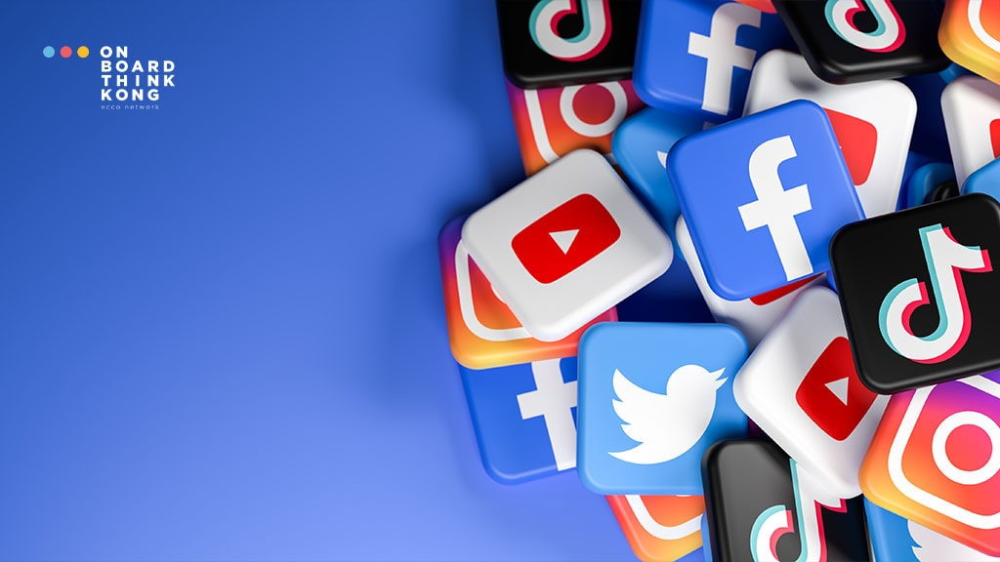

# test1
# TEAM

1.Filak Michał, Filak Michał, Tasks 4 and 5

2.Norbert Czerw, Norbert Czerw, Tasks 1 and 6

3.Jakub Horowski, Jakub Horowski, Tasks 2 and 3

# WPROWADZENIE
Media społecznościowe na stałe zagościły w naszym życiu. Już nie zakładamy konta tylko na jednym, wybranym portalu – mamy ich kilka na różnych platformach. W dzisiejszych czasach bycie obecnym w serwisach społecznościowych daje nam bardzo wiele możliwości. Jedną z nich jest podtrzymywanie relacji z innymi osobami. Nie tylko możemy być w stałym kontakcie z rodziną czy najbliższymi przyjaciółmi, ale także możemy rozmawiać z osobami z drugiego końca świata.

Nie tylko w życiu prywatnym korzystamy z takich portali społecznościowych. Większość firm obecnych na rynku ma swój firmowy profil na Facebooku, czy Instagramie. Korzystają z nich nie tylko w celu przedstawienia swojej oferty, ale także do obsługi klienta lub nawet sprzedaży za pomocą zintegrowanych sklepów internetowych. Dziś chcielibyśmy przedstawić Wam ranking mediów społecznościowych. Jesteśmy ciekawi, ile z wybranych przez nas platform znacie, a które będą dla Was zupełną nowością.

Najpopularniejsze portale społecznościowe to Facebook, YouTube, Instagram i TikTok, które służą do budowania sieci społecznych i dzielenia się treściami. Inne znane platformy to między innymi LinkedIn (do celów zawodowych), X (dawniej Twitter) (mikroblogowanie), Snapchat oraz komunikatory takie jak WhatsApp i Messenger. Każdy z tych serwisów ma inne funkcje i kieruje do innej grupy odbiorców, oferując różne sposoby interakcji. 

# DANE
Dziś chcielibyśmy przedstawić Wam ranking mediów społecznościowych. Jesteśmy ciekawi, ile z wybranych przez nas platform znacie, a które będą dla Was zupełną nowością.

|Serwis|Liczba użytkowników (Polska, 2025)|Liczba użytkowników (Świat, 2025)|Rok Powstania|
|------|----------------------------------|---------------------------------|-------------|
|Facebook|18,7 mln (48,6% populacji)|2,989 mld|2004|
|YouTube|29 mln (75,6% populacji)|2,5 mld|2005|
|Instagram|11,3 mln (29,5% populacji)|2 mld|2010|

# OBRAZY

